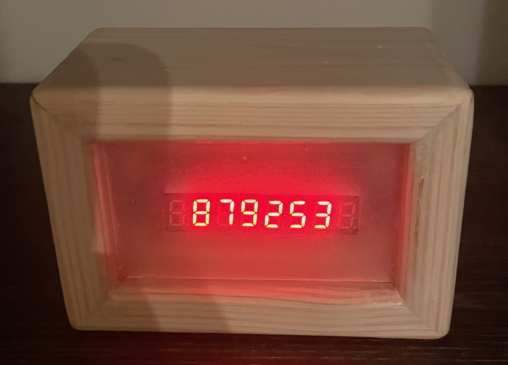

# esp-blockclock
A clock running on ESP8266 which shows the current bitcoin blocktime using a 7-segment display

# requirements
- an ESP8266 or similar (I used an wemos D1 mini clone)
- a MAX7219 based 7-segment display (I used this one: https://www.amazon.de/dp/B07Z7RHD2J?ref=ppx_yo2ov_dt_b_fed_asin_title)
- some wires
- a 5V power supply

# wiring
TODO

# dependencies
- Arduino IDE (I use V2.3.4)
- LedController library (https://github.com/noah1510/LedController, I use V2.02)
